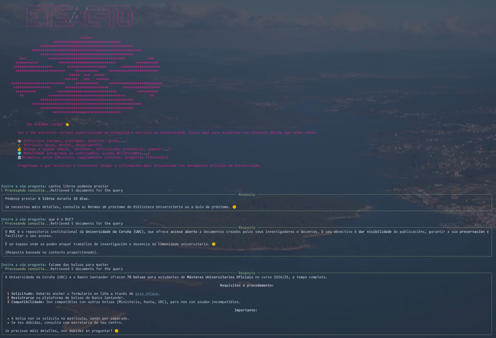

# 🎓 ETSACTO

<div align="center">
  
  
  
</div>
<p align="center">
  
</p>


## 📘 Descrición

ETSACTO é un asistente virtual intelixente especializado en normativa e servizos da Universidade da Coruña (UDC). Baseado en tecnoloxía RAG (Retrieval Augmented Generation), este sistema permite acceder de forma rápida e natural á información oficial da universidade a través de consultas en linguaxe natural.

O nome "ETSACTO" fai honra ó organismo mecenas do proxecto, a biblioteca da ETSAC. Especial agradecemento a Mayra. 

<p align="center">
  
</p>

## ✨ Características

- **💬 Consultas en linguaxe natural**: Interactúa co sistema como se estiveses falando cunha persoa
- **🔍 Recuperación precisa**: Utiliza tecnoloxía vectorial para atopar a información máis relevante
- **📊 Procesamento de documentos**: Compatible con PDFs e HTML procedentes da documentación oficial
- **🌐 Multilingüe**: Soporta consultas en galego, castelán e inglés
- **🧠 Modelos flexibles**: Permite utilizar modelos locais ou Mistral API

## 🛠️ Tecnoloxías

- **[LangChain](https://github.com/langchain-ai/langchain)**: Framework para aplicacións impulsadas por LLMs
- **[FAISS](https://github.com/facebookresearch/faiss)**: Biblioteca de busca vectorial eficiente
- **[PyTorch](https://pytorch.org/)**: Framework para o procesamento de modelos de aprendizaxe automática
- **[Transformers](https://github.com/huggingface/transformers)**: Biblioteca para modelos pre-adestrados
- **[Mistral AI](https://mistral.ai/)**: API para modelos de linguaxe de alta calidade
- **[Rich](https://github.com/textualize/rich)**: Formateo de texto para unha mellor experiencia de terminal

## 🚀 Instalación

```bash
# Clonar o repositorio
git clone https://github.com/PepeRoConde/etsacto.git
cd etsacto

# Crear e activar un entorno virtual
python -m venv venv
source venv/bin/activate  # En Windows: venv\Scripts\activate

# Instalar dependencias
pip install -r requirements.txt
```

## 🔧 Configuración

Antes de usar ETSACTO, debes configurar o seguinte:

1. **Documentos**: Coloca os PDFs e arquivos HTML que desexas indexar nunha carpeta
2. **API Key**: Para usar Mistral AI, establece a túa clave API como variable de entorno:

A API de Mistral e gratuita para certos modelos. 

```bash
export MISTRAL_API_KEY=a_tua_clave_api
```

## 📋 Uso

### Modo local (sen API externa)

```bash
python main.py --docs_folder "./docs" --language "galician" --verbose
```

### Con Mistral API

```bash
python Mistral_main.py --docs_folder "./docs" --language "galician" --model "mistral-medium"
```

### Opcións principais

| Opción | Descrición | Valor predeterminado |
|--------|------------|----------------------|
| `--docs_folder` | Cartafol cos documentos | `/Users/pepe/OneDrive - Universidade da Coruña/documentacion_y_normativa` |
| `--vector_store` | Ruta para gardar/cargar a base vectorial | `local_vectorstore` |
| `--rebuild` | Reconstruír a base vectorial aínda que exista | `False` |
| `--language` | Idioma para as consultas (galician, spanish, english) | `galician` |
| `--model` | Modelo de Mistral a usar (tiny, small, medium, large) | `mistral-medium` |
| `--k` | Número de documentos a recuperar por consulta | `4` |
| `--verbose` | Mostrar información detallada incluíndo fontes | `False` |

## 📝 Exemplos de uso

O sistema responde a preguntas sobre servizos e normativas da UDC:

- **Biblioteca**: Normas de préstamo, horarios, guías...
- **Matrícula**: Prazos, doutoramento, procedementos...
- **Bolsas e axudas**: Becas, Santander, dificultades económicas, comedor...
- **Mobilidade**: Programas de intercambio, Erasmus Mundus...
- **Normativa xeral**: Estatutos, regulamentos internos, preguntas frecuentes...

## 👥 Contribucións

As contribucións son benvidas! Se queres mellorar ETSACTO, considera:

1. Abrir unha incidencia para discutir o que che gustaría cambiar
2. Enviar un Pull Request coas túas melloras
3. Engadir máis documentación para mellorar a base de coñecemento

## 📄 Licenza

Este proxecto está licenciado baixo a licenza GNU - ver o arquivo `LICENSE` para máis detalles.

## 📧 Contacto

Para preguntas ou suxestións, por favor contacta con:
- **Email**: j.rconde@udc.gal

---

<div align="center">
  <p>Feito con ❤️ na Biblioteca da ETSAC, Universidade da Coruña</p>
</div>
